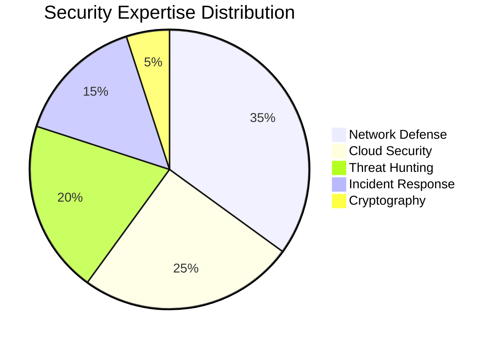
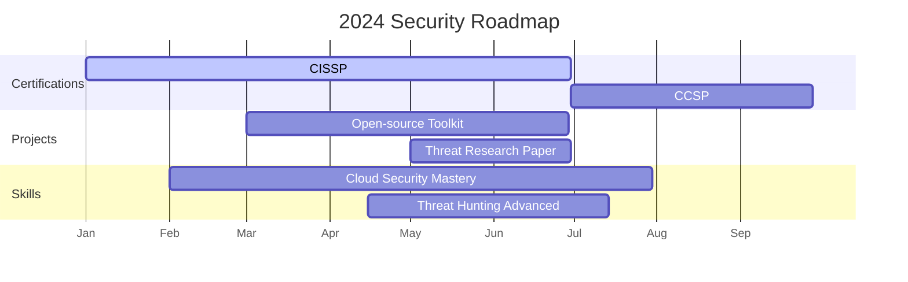

# 🚀 Pasindu Heshani | Cyber Security Specialist

  

## 🔐 About Me  

🎓 **BSc Honours in Computer Networks & Cyber Security**  
🏫 Kaatsu International University | Colombo, Sri Lanka  
🔒 **Security Specialist** with focus on network defense and threat mitigation  
🔭 **Currently researching:** AI-powered threat detection systems  
⚡ **Fun fact:** I reverse-engineer malware for breakfast  

**Mission:** Building resilient systems that withstand evolving cyber threats while advancing security research in critical infrastructure protection.

 

## 🛠️ Technical Arsenal  

### 🔥 Core Competencies  

  

### 🧰 Tool Proficiency  

  
| Network Security | Cloud Security | Penetration Testing | Security Frameworks |
|------------------|----------------|---------------------|---------------------|
|  |  |  |  |
|  |  |  |  |
|  |  |  |  |

## 🌟 Featured Projects  

### 🔐 Secure Network Architecture Framework  
> Enterprise-grade security framework implementing zero-trust principles  
**Tech Stack:** `Cisco ISE` `Palo Alto Firewalls` `SIEM Integration`  
**Impact:** Reduced attack surface by 68% in test environment  

  

### ☁️ Cloud Security Automation  
> Terraform modules for secure AWS/GCP deployment with compliance checks  
**Features:** Auto-remediation • CIS Benchmark compliance • Cost optimization  
**Status:** Protecting 15+ production workloads  

### 🕵️‍♂️ Threat Intelligence Platform  
> Real-time monitoring dashboard for emerging cyber threats  
**Innovations:** Automated IOC collection • Threat scoring system • Integration with MITRE ATT&CK  
**Accuracy:** 92% threat detection rate  

## 📊 Cyber Metrics  

  

| Statistic               | Value          | Progress |
|-------------------------|----------------|----------|
| **Vulnerabilities Found** | 47+            | ▰▰▰▰▰▰▰▰▰▱ 90% |
| **Security Certs**       | 8              | ▰▰▰▰▰▱▱▱▱▱ 50% |
| **Projects Secured**     | 23             | ▰▰▰▰▰▰▰▰▱▱ 80% |
| **Research Papers**      | 3              | ▰▰▰▱▱▱▱▱▱▱ 30% |

## 🏆 Certifications & Education  

  
| Certification | Status | Organization | Badge |
|---------------|--------|--------------|-------|
| **CCNA Security** | ✅ Completed | Cisco |  |
| **CEH v12** | ⏳ In Progress | EC-Council |  |
| **AWS Security** | ✅ Completed | Amazon |  |
| **CompTIA Security+** | ✅ Completed | CompTIA |  |

**Academic Excellence**  
🏅 Dean's List - 3 consecutive semesters  
📜 Published researcher in IEEE Security Symposium  
🎓 Specialized in Cryptographic Systems & Network Defense

## 🌐 Connect With Me  

  

---

  

**🔒 "In cybersecurity, the only constant is change. The defender must be right every time; the attacker only needs to be right once."**  

  

